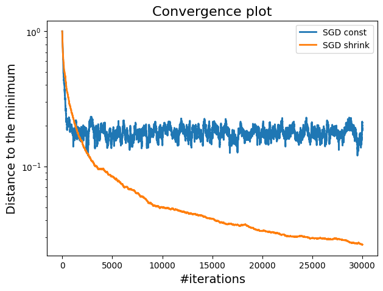
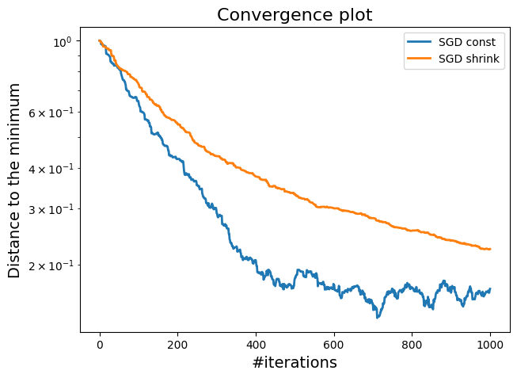
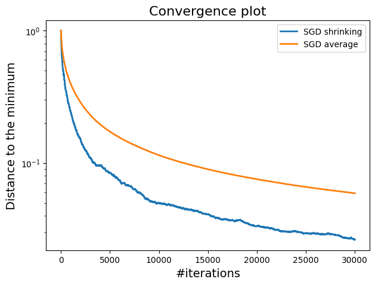

# Stochastic Gradient Descent implementation 

In this repository, we present a series of experiments to evaluate the performance of different variants of Stochastic Gradient Descent (SGD). Each subsection details a specific variant or aspect of SGD, providing insights into their behavior and effectiveness in various settings.Here we share with you some comparison results.


### 1. Comparison of SGD with constant step size and SGD with Shrinking Step Size

<!-- | Model    |  SGD with constant step size | SGD with Shrinking Step Size |   
|----------|-----------------|-----------------|
| Linear   |    At beginning, performs better.            | reaches the best solution           |
| Logistic |    55.8         | 29.9            |   -->


- SGD with a constant step size performs better initially, but as the process continues, the shrinking step size begins to converge to the optimal solution. In contrast, the constant step size descends quickly at first but then starts to fluctuate around similar values

What happens when is you use sampling without replacement instead:  


SGD with constant stepsizes is faster at the beginning, while, SGD with shrinking stepsizes reaches the best solution.

### 2. Comparison of SGD with shrinking stepsizes and SGD with averaging.


SGD with shrinking stepsizes is faster and performs better than SGD with averaging

### 3.Comparison of SGD with momentum and with averaging

### 4.Comparison of SGD with momentum and SGD with decreasing stepsizes with late start

### 5.Comparison of all SGD 

### 6.GD with SGD

### 7.Compare SGD and GD in terms of test error. That is, use w_model_truth to compare


### Project Structure 

- `Final_Notebook_SGD_Final_Lab.ipynb`: All implementations
- `assets`: Contains session images readme

### Build With

**Language:** Python

### Note
- weight averaging
$$
w_{\text{average}}^{(k)} = \frac{(k - \text{start\_averaging}) \cdot w_{\text{average}}^{(k-1)} + w^{(k)}}{k - \text{start\_averaging} + 1}
$$
where :
- $ w_{\text{average}}^{(k)} $ is the averaged weight vector at iteration \( k \),
- $ w^{(k)} $ is the current weight vector at iteration \( k \),
- $ \text{start\_averaging} $ is the iteration at which averaging begins
- $ k $ is the index of the current iteration.

Using this formula presents the following advantages:

**Memory**: The recursive formula only requires storing two weight vectors at a time. This significantly reduces memory usage.

**Computation**: It reduces the computational cost and makes it more efficient in real-time.

### Run Locally

Clone the project
```bash
    git clone https://github.com/Omer-alt/-Stochastic-Gradient-Descent.git
```

Run the notebook with Google collab or locally with jupiter.

### Authors

- [@Fotso Omer](https://portfolio-omer-alt.vercel.app/)
- [@Asim Abdalla](https://github.com/asimzz)
- [@leema Hmaid](https://github.com/leemaHmaid)

### License

[MIT](https://choosealicense.com/licenses/mit/)